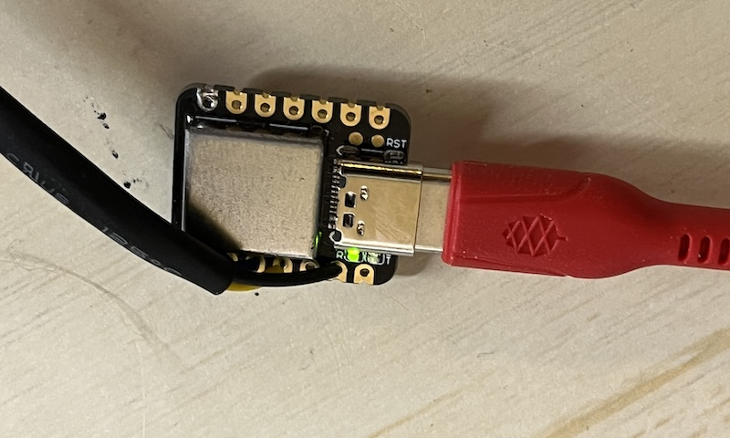
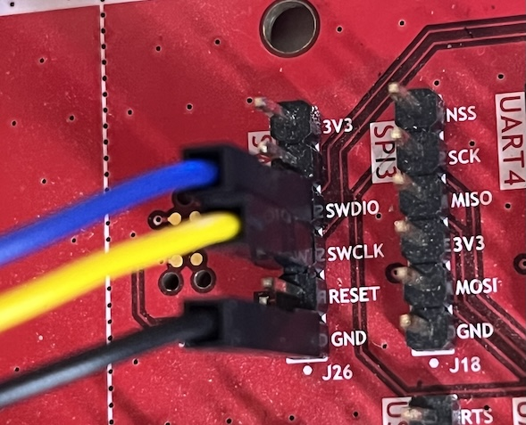

# jctest_rust_embassy_stm32

This is a simple exercise for me to learn developing firmware
for STM microcontrollers using rust and [embassy](https://embassy.dev)


## Setup

Install the [rustup](https://rustup.rs) toolchain installer, to compile Rust code.
Install [probe-rs](https://probe.rs/) - to flash the firmware on your device. If you already have other tools like OpenOCD setup, you can use that as well.

### Probe
My probe is a Seeduino XIAO, which is a SAMD21 based board. I installed the [CMSIS-DAP](https://wiki.seeedstudio.com/Seeeduino-XIAO-DAPLink/) 
firmware on it, so that it can be used as a CMSIS-DAP probe.




### Connection
The STM board I'm using has a 6-pin SWD connector.
Blue -- SWDIO
Yellow -- SWCLK
Black -- GND



## Run

```
cargo build --bin jctest
```


This skeleton app was created using [cargo-embassy](https://github.com/adinack/cargo-embassy)
